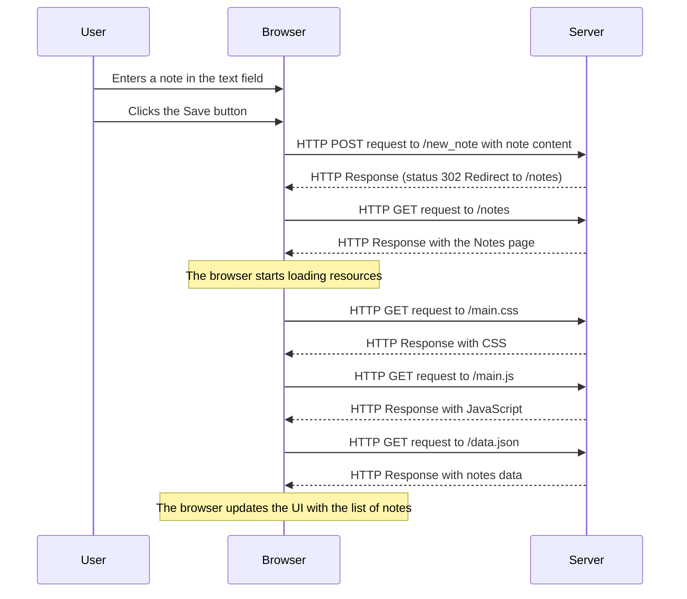

```mermaid
sequenceDiagram
    participant User
    participant Browser
    participant Server

    User->>Browser: Enters a note in the text field
    User->>Browser: Clicks the Save button
    Browser->>Server: HTTP POST request to /new_note with note content
    Server-->>Browser: HTTP Response (status 302 Redirect to /notes)
    Browser->>Server: HTTP GET request to /notes
    Server-->>Browser: HTTP Response with the Notes page
    Note over Browser: The browser starts loading resources
    Browser->>Server: HTTP GET request to /main.css
    Server-->>Browser: HTTP Response with CSS
    Browser->>Server: HTTP GET request to /main.js
    Server-->>Browser: HTTP Response with JavaScript
    Browser->>Server: HTTP GET request to /data.json
    Server-->>Browser: HTTP Response with notes data
    Note over Browser: The browser updates the UI with the list of notes
```
