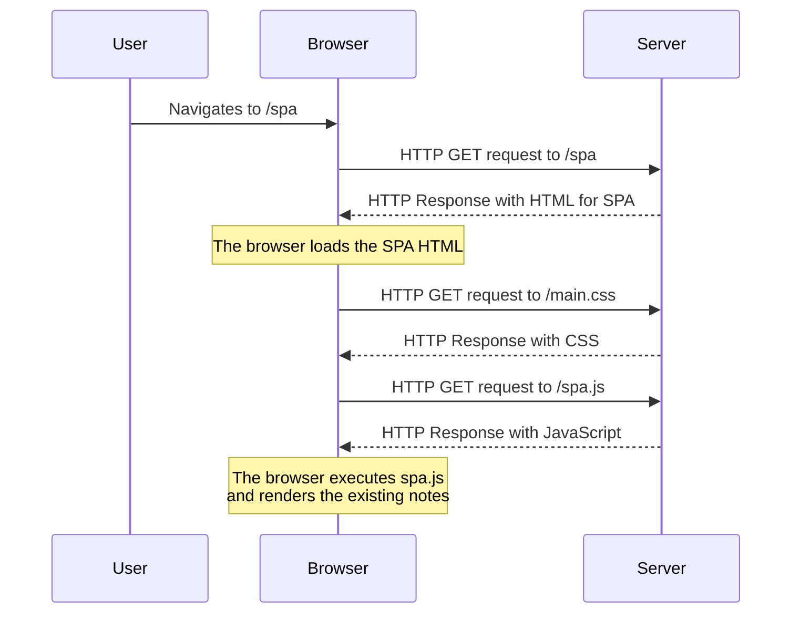

```mermaid
sequenceDiagram
    participant User
    participant Browser
    participant Server

    User->>Browser: Navigates to /spa
    Browser->>Server: HTTP GET request to /spa
    Server-->>Browser: HTTP Response with HTML for SPA
    Note over Browser: The browser loads the SPA HTML
    Browser->>Server: HTTP GET request to /main.css
    Server-->>Browser: HTTP Response with CSS
    Browser->>Server: HTTP GET request to /spa.js
    Server-->>Browser: HTTP Response with JavaScript
    Note over Browser: The browser executes spa.js<br>and renders the existing notes
```
