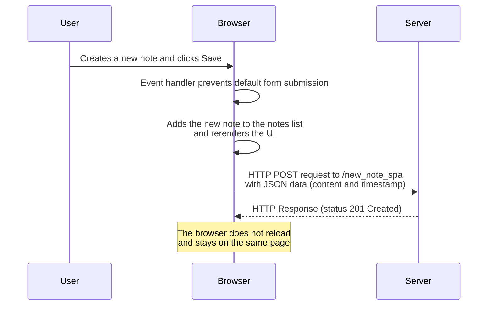

```mermaid
sequenceDiagram
    participant User
    participant Browser
    participant Server

    User->>Browser: Creates a new note and clicks Save
    Browser->>Browser: Event handler prevents default form submission
    Browser->>Browser: Adds the new note to the notes list<br>and rerenders the UI
    Browser->>Server: HTTP POST request to /new_note_spa<br>with JSON data (content and timestamp)
    Server-->>Browser: HTTP Response (status 201 Created)
    Note over Browser: The browser does not reload<br>and stays on the same page
```
